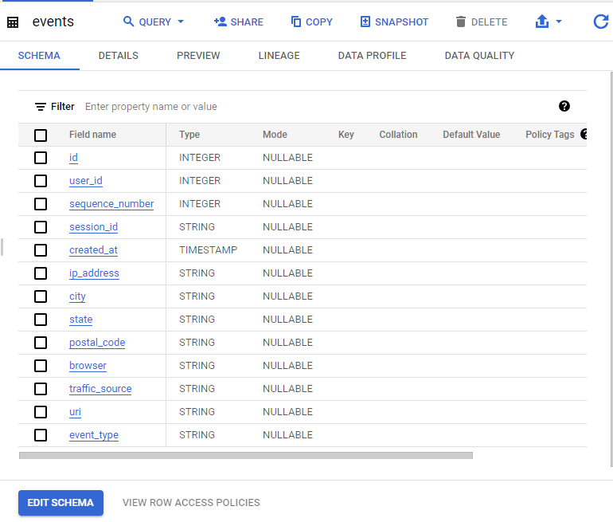
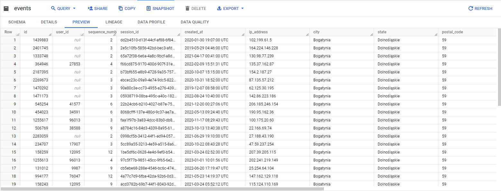
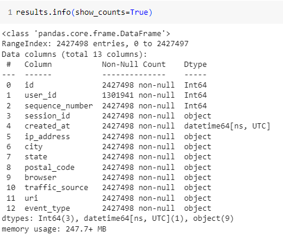

<head>
</head>

<body>

<div style="text-align: justify; text-justify: inter-word;">

# [SQL - BigQuery - Google Sheet - Power BI] theLook eCommerce - EDA

## I. Introduction
The project focuses on analyzing customer activity data on theLook eCommerce website. The aim is to understand how customers navigate the site and interact with it. By gaining insights from this data, the goal is to develop strategies that can boost the website's conversion rate and drive higher sales.

In this project, we'll gather and process data using ***SQL*** on ***BigQuery***, followed by visualization using either ***Google Sheets*** or ***Power BI***.

## II. Dataset overview
### 1. theLook eCommerce
This dataset is come from [theLook eCommerce](https://console.cloud.google.com/marketplace/product/bigquery-public-data/thelook-ecommerce), which is published on BigQuery Public Data.

TheLook is a fictitious eCommerce clothing site developed by the Looker team. The contents of this dataset are synthetic, and are provided to industry practitioners for the purpose of product discovery, testing, and evaluation.

The dataset is refreshed on a daily basis.

To access the dataset, you can follow these steps:

    1. Log in to your Google Cloud Platform account and create a new project.
    2. Navigate to the BigQuery console and choose your newly created project.
    3. In the navigation panel, click on "Add Data," then scroll down to "Additional Sources," and select "Public Datasets."
    4. Search for "theLook eCommerce" and click on "View Dataset." You'll find the public project "bigquery-public-data" in the navigation panel. Click the toggle node to display all datasets and locate the "theLook eCommerce" dataset.
    5. Click on the toggle node beside the dataset and opt for the "events" table to access its contents.

### 2. Dataset profile

The "events" table contains 13 columns and spans over 2.43 million rows. Each row corresponds to an event that occurred on the company website, covering data from 2019 to the present day.

<div align="center">

Columns



Data Preview



Non-null Counts 



</div>

As you can see, only the 'user_id' column has null values, indicating that the visitors are guests.

Therefore, the dataset is ready for analysis.

## III. Objective
This project aims to analyze web events data from the past 12 months. We'll explore traffic sources, customer activities, conversion rates, and sales funnels.

To break it down, we'll look into the steps a customer takes: visiting the site, viewing products, adding items to the cart, and making purchases or step out.

## IV. Analysis

    All sessions considered will be based on their session start times, from Oct 2022 to Oct 2023, encompassing the last 12 months.

### 1. Sessions by browser
```sql
select
  browser,
  count(session_id) as total_session_count
from 
    `bigquery-public-data.thelook_ecommerce.events`
where 
    sequence_number = 1 --(distinct count session_id)
    and created_at > parse_timestamp('%Y-%m-%d', '2022-10-01')
    and created_at < parse_timestamp('%Y-%m-%d', '2023-10-01')
group by 
    browser;
```

<div align="center">

|Row|browser|total_session_count|
|:--|:--|--:|
|1|Other|8,912|
|2|IE|8,984|
|3|Safari|35,820|
|4|Firefox|35,980|
|5|Chrome|88,976|

Table 1. Sessions by browser

</div> 

The majority of traffic originates from the Chrome browser, whereas the performance of the IE browser is notably poor.

<div align="center">


Chart 1. Sessions by browser

</div> 


### 2. Visitor types, and bounce rate
#### 2.1. Visitor
```sql
with total as(
  select
    count(session_id) as total_visitors
  from `bigquery-public-data.thelook_ecommerce.events`
where sequence_number = 1
and created_at > parse_timestamp('%Y-%m-%d', '2022-10-01')
and created_at < parse_timestamp('%Y-%m-%d', '2023-10-01')
), visitors_type as(
select
  case when user_id is null then 'Guest' else 'Member' end as visitor_type,
  count(session_id) as total_session_count
from `bigquery-public-data.thelook_ecommerce.events`
where sequence_number = 1
and created_at > parse_timestamp('%Y-%m-%d', '2022-10-01')
and created_at < parse_timestamp('%Y-%m-%d', '2023-10-01')
group by 1)
select
  vt.visitor_type,
  vt.total_session_count,
  round(safe_divide(vt.total_session_count, tb.total_visitors), 4) as percentage_of_total
from visitors_type vt
left join total tb
on true;
```

<div align="center">

|Row|visitor_type|total_session_count|percentage_of_total
|:--|:--|--:|--:|
|1|Member|76,965|0.4308|
|2|Guest|101707|0.5692|

Table 2. Visitors Type
</div>

<div align="center">


Chart 2. Visitors Type

</div>

Given that approximately 57% of sessions in this period are attributed to guest users, it's clear that we should focus on engaging our members. Encouraging their return visits to our webshop and facilitating purchases could be a key strategy beside of getting new customers, and leads.

#### 2.2. Bounce rate

Based on Table 2, it's evident that theLook Ecommerce webshop attracts potential members primarily from guest visitors. Our next step involves analyzing the quality of these leads by identifying the number of bounce sessions, which are sessions characterized by only one activity before users exit the site.

```sql
with bounce_identify as(
  select
    session_id,
    case when user_id is null then 'Guest' else 'Member' end as visitor_type,
    case when max(sequence_number) = 1 then 'Yes' else 'No' end as bounce_session
  from `bigquery-public-data.thelook_ecommerce.events`
where created_at > parse_timestamp('%Y-%m-%d', '2022-10-01')
and created_at < parse_timestamp('%Y-%m-%d', '2023-10-01')
group by 1, 2
)
select
  visitor_type,
  count(session_id) as total_session_count,
  sum(case when bounce_session = 'Yes' then 1 else 0 end) as bounce_session_count,
  round(
    safe_divide(
      sum(case when bounce_session = 'Yes' then 1 else 0 end),  count(session_id)
    )
  ,4) as bounce_session_rate
from bounce_identify
group by 1;
```
<div align="center">

|Row|visitor_type|total_session_count|bounce_session_count|bounce_session_rate|
|:--|:--|--:|--:|--:|
|1|Member|76,965|0|0.0|
|2|Guest|101,707|22,284|0.2486|

Table 3. Bounce rate by visitors type
</div>

The bounce rate for Members is notably excellent during this time period, and even for Guests, only 24.86% of their sessions result in bounces. This suggests that when a guest visits theLook Ecommerce webshop, they tend to engage with contents on the site.

In my opinion, these leads are very potential to forcus on them to convert into our loyalty custormers.

In the next step, I'll examine the traffic sources of bounce sessions to uncover any patterns or insights.

```sql
with bounce_identify as(
  select
    session_id,
    traffic_source,
    case when max(sequence_number) = 1 then 'Yes' else 'No' end as bounce_session
  from `bigquery-public-data.thelook_ecommerce.events`
where user_id is null
group by 1, 2
having min(created_at) > parse_timestamp('%Y-%m-%d', '2022-10-01')
and min(created_at) < parse_timestamp('%Y-%m-%d', '2023-10-01')
)
select 
  traffic_source,
  count(session_id) as total_session_count,
  sum(case when bounce_session = 'Yes' then 1 else 0 end) as bounce_session_count,
  round(
    safe_divide(
      sum(case when bounce_session = 'Yes' then 1 else 0 end),  count(session_id)
    )
  ,4) as bounce_session_rate
from bounce_identify
group by 1
order by 2 DESC;
```

<div align="center">

|Row|traffic_source|total_session_count|bounce_session_count|bounce_session_rate|
|:--|:--|--:|--:|--:|
|1|Email|45,617|11,337|0.2485|
|2|Adwords|30,341|7,547|0.2487|
|3|Facebook|10,299|2,601|0.2525|
|4|YouTube|10,281|2,541|0.2472|
|5|Organic|5,169|1,258|0.2434|

Table 4. Bounce rate of Guest
</div>

As indicated in Table 4, all traffic sources exhibit a similar ratio, approximately 24-25% for bounce sessions. This suggests that traffic sources might not be the primary contributors to bounce sessions.

This indicates that in devising a strategy to reduce bounce rates, our focus should shift toward other factors rather than solely concentrating on traffic sources

### 3. Conversion rate

An essential metric to track on a webshop is the Conversion Rate, calculated by dividing total purchase sessions by total visited sessions on the webshop. This metric illustrates the ratio of sessions that lead to sales and revenue for the company. 

It offers insights into whether the webshop design and the products offered are compelling enough to persuade customers to make purchases.

It's also a critical metric for evaluating the effectiveness of a campaign.

```sql
with total_session as(
  select
    traffic_source,
    count(session_id) as total_session
  from `bigquery-public-data.thelook_ecommerce.events`
  where sequence_number = 1
  and created_at > parse_timestamp('%Y-%m-%d', '2022-10-01')
  and created_at < parse_timestamp('%Y-%m-%d', '2023-10-01')
  group by 1
),
purchased_session as(
  select
    traffic_source,
    count(session_id) as total_purchased_session
  from `bigquery-public-data.thelook_ecommerce.events`
  where event_type = 'purchase'
  and session_id in ( select 
                      session_id 
                      from `bigquery-public-data.thelook_ecommerce.events`
                      where sequence_number = 1
                      and created_at > parse_timestamp('%Y-%m-%d', '2022-10-01')
                      and created_at < parse_timestamp('%Y-%m-%d', '2023-10-01'))
  group by 1
)
select
  ts.traffic_source,
  ps.total_purchased_session,
  ts.total_session,
  round(safe_divide(ps.total_purchased_session,ts.total_session),4) as conversion_rate
from total_session ts
left join purchased_session ps 
on ts.traffic_source = ps.traffic_source;
```
<div align="center">

|Row|traffic_source|total_purchased_session|total_session|conversion_rate|
|:--|:--|--:|--:|--:|
|1|Email|34771|80388|0.4325|
|2|Adwords|22790|53131|0.4289|
|3|Facebook|7906|18205|0.4343|
|4|YouTube|7581|17862|0.4244|
|5|Organic|3917|9086|0.4311|

Table 5. Conversion rate by traffic sources
</div>

Table 5 displays the conversion rate of theLook Ecommerce webshop within this time frame. However, this figure alone might not provide insightful information. It would be beneficial to compare it with industry benchmarks or the company's historical performance for a more comprehensive understanding.

Because of the limitation of data, in this analysis I will compared it with historical performance.

```sql
with rolling_session as(
  select
    distinct
    date_trunc(created_at, MONTH) as event_month,
    traffic_source,
    count(session_id) over (partition by traffic_source
                            order by traffic_source, date_trunc(created_at, MONTH) ASC 
                            range between unbounded preceding and current row) as running_session
  from `bigquery-public-data.thelook_ecommerce.events`
  where sequence_number = 1
    and created_at > parse_timestamp('%Y-%m-%d', '2022-10-01')
    and created_at < parse_timestamp('%Y-%m-%d', '2023-10-01')
  order by 2,1 asc
),
rolling_purchased_session as(
  select
    distinct
    date_trunc(created_at, MONTH) as event_month,
    traffic_source,
    count(session_id) over (partition by traffic_source 
                            order by traffic_source, date_trunc(created_at, MONTH) ASC 
                            range between unbounded preceding and current row) as running_purchase_session
  from `bigquery-public-data.thelook_ecommerce.events`
  where event_type = 'purchase'
  and session_id in ( select 
                      session_id 
                      from `bigquery-public-data.thelook_ecommerce.events`
                      where sequence_number = 1
                      and created_at > parse_timestamp('%Y-%m-%d', '2022-10-01')
                      and created_at < parse_timestamp('%Y-%m-%d', '2023-10-01'))
  order by 2,1 ASC
)
select
  rs.traffic_source,
  rs.event_month,
  rs.running_session,
  rps.running_purchase_session,
  round(safe_divide(rps.running_purchase_session, rs.running_session),4) as rolling_conversion_rate
from rolling_session rs
left join rolling_purchased_session rps
on rs.traffic_source = rps.traffic_source
and rs.event_month = rps.event_month
order by 1,2 ASC;
```
<div align="center">

|Row|traffic_source|event_month|running_session|running_purchase_session|rolling_conversion_rate|
|:--|:--|--:|--:|--:|--:|
|1|Adwords|2022-10-01 UTC|3819|1250|0.3273|
|2|Adwords|2022-11-01 UTC|7714|2572|0.3334|
|3|Adwords|2022-12-01 UTC|11774|4075|0.3461|
|4|Adwords|2023-01-01 UTC|15934|5636|0.3537|
|5|Adwords|2023-02-01 UTC|19808|7153|0.3611|
|6|Adwords|2023-03-01 UTC|24282|8965|0.3692|
|7|Adwords|2023-04-01 UTC|28483|10767|0.378|
|8|Adwords|2023-05-01 UTC|33043|12788|0.387|
|9|Adwords|2023-06-01 UTC|37714|14945|0.3963|
|10|Adwords|2023-07-01 UTC|42579|17279|0.4058|
|11|Adwords|2023-08-01 UTC|47877|19922|0.4161|
|12|Adwords|2023-09-01 UTC|53131|22685|0.427|
|13|Email|2022-10-01 UTC|5958|2011|0.3375|
|14|Email|2022-11-01 UTC|11849|4148|0.3501|
|15|Email|2022-12-01 UTC|18035|6451|0.3577|
|16|Email|2023-01-01 UTC|24373|8915|0.3658|
|17|Email|2023-02-01 UTC|30251|11267|0.3725|
|18|Email|2023-03-01 UTC|36865|13956|0.3786|
|19|Email|2023-04-01 UTC|43458|16766|0.3858|
|20|Email|2023-05-01 UTC|50273|19757|0.393|
|21|Email|2023-06-01 UTC|57278|22997|0.4015|
|22|Email|2023-07-01 UTC|64652|26497|0.4098|
|23|Email|2023-08-01 UTC|72445|30342|0.4188|
|24|Email|2023-09-01 UTC|80388|34605|0.4305|
|25|Facebook|2022-10-01 UTC|1339|455|0.3398|
|26|Facebook|2022-11-01 UTC|2657|927|0.3489|
|27|Facebook|2022-12-01 UTC|4050|1444|0.3565|
|28|Facebook|2023-01-01 UTC|5429|2005|0.3693|
|29|Facebook|2023-02-01 UTC|6690|2486|0.3716|
|30|Facebook|2023-03-01 UTC|8248|3133|0.3798|
|31|Facebook|2023-04-01 UTC|9727|3782|0.3888|
|32|Facebook|2023-05-01 UTC|11335|4511|0.398|
|33|Facebook|2023-06-01 UTC|12933|5260|0.4067|
|34|Facebook|2023-07-01 UTC|14658|6072|0.4142|
|35|Facebook|2023-08-01 UTC|16463|6998|0.4251|
|36|Facebook|2023-09-01 UTC|18205|7873|0.4325|
|37|Organic|2022-10-01 UTC|672|206|0.3065|
|38|Organic|2022-11-01 UTC|1335|451|0.3378|
|39|Organic|2022-12-01 UTC|2055|746|0.363|
|40|Organic|2023-01-01 UTC|2781|1027|0.3693|
|41|Organic|2023-02-01 UTC|3445|1302|0.3779|
|42|Organic|2023-03-01 UTC|4114|1559|0.3789|
|43|Organic|2023-04-01 UTC|4834|1861|0.385|
|44|Organic|2023-05-01 UTC|5605|2199|0.3923|
|45|Organic|2023-06-01 UTC|6401|2560|0.3999|
|46|Organic|2023-07-01 UTC|7300|2989|0.4095|
|47|Organic|2023-08-01 UTC|8222|3451|0.4197|
|48|Organic|2023-09-01 UTC|9086|3894|0.4286|
|49|YouTube|2022-10-01 UTC|1361|467|0.3431|
|50|YouTube|2022-11-01 UTC|2690|941|0.3498|
|51|YouTube|2022-12-01 UTC|4080|1432|0.351|
|52|YouTube|2023-01-01 UTC|5391|1929|0.3578|
|53|YouTube|2023-02-01 UTC|6645|2443|0.3676|
|54|YouTube|2023-03-01 UTC|8132|3033|0.373|
|55|YouTube|2023-04-01 UTC|9675|3674|0.3797|
|56|YouTube|2023-05-01 UTC|11138|4298|0.3859|
|57|YouTube|2023-06-01 UTC|12594|4957|0.3936|
|58|YouTube|2023-07-01 UTC|14247|5713|0.401|
|59|YouTube|2023-08-01 UTC|16015|6577|0.4107|
|60|YouTube|2023-09-01 UTC|17862|7542|0.4222|

Table 6. Rolling conversion rate over the time period

</div>

<div align="center">


Chart 3. Rolling conversion rate over the time period

</div>

Based on Table 6, and Chart 3, it's evident that all traffic sources exhibit a steady increase in conversion rates over the months. It indicates that theLook Ecommerce business are performing well.

Next, we look into funnel of sale.

### 4. Sales funnel

Considering the dataset's feasibility and for the sake of simplification, I've structured the sales funnel to encompass three steps: viewing the product, adding it to the cart, and completing the purchase.

Using this funnel, we'll identify the stage at which customers drop off, abandon their carts, and leave the purchase incomplete.

    In which:
    view_product_page = 100% 
    add_to_cart_rate = sessions_add_to_cart/sessions_view_product
    purchase_rate = sessions_purchase/sessions_add_to_cart
    conversion_rate = sessions_purchase/sessions_view_product
    therefore:
    conversion_rate = purchase_rate*add_to_cart_rate (i)
                    = (1 - cart_abandon_rate)*(1 - leave_product_page_rate) (ii)

```sql
with funnel as(
  select
    session_id,
    min(created_at) as session_begin_at,
    sum(case when event_type = 'product' then 1 else 0 end) as view_product,
    sum(case when event_type = 'cart' then 1 else 0 end) as add_to_cart,
    sum(case when event_type = 'purchase' then 1 else 0 end) as purchase
  from `bigquery-public-data.thelook_ecommerce.events`
  group by 1
  having min(created_at) > parse_timestamp('%Y-%m-%d', '2022-10-01')
  and min(created_at) < parse_timestamp('%Y-%m-%d', '2023-10-01')
),
-- count the session
sessions_count as(
select
  format_timestamp('%Y-%b', session_begin_at) as year_mmm,
  count(distinct session_id) as total_session,
  sum(case when view_product > 0 then 1 else 0 end) as sessions_view_product,
  sum(case when add_to_cart > 0 then 1 else 0 end) as sessions_add_to_cart,
  sum(case when purchase > 0 then 1 else 0 end) as sessions_purchase,
from funnel
group by 1)
select
  year_mmm,
  total_session,
  sessions_view_product,
  sessions_add_to_cart,
  sessions_purchase,
  round(safe_divide(sessions_add_to_cart, sessions_view_product),4) as add_to_cart_rate,
  round(1 - safe_divide(sessions_add_to_cart, sessions_view_product), 4) as leave_product_page_rate,
  round(safe_divide(sessions_purchase, sessions_add_to_cart),4) as purchase_rate,
  round(1 - safe_divide(sessions_purchase, sessions_add_to_cart), 4) as cart_abandon_rate,
  round(safe_divide(sessions_purchase, sessions_view_product), 4) as conversion_rate
from sessions_count;
```

<div align="center">


Chart 5. Visitor activities over the months
____


</div>

<div align="center">


Image 1. Sales Funnel over time period

____

|Metric|Value|
|--|--:|
|total_session|178,672|
|sessions_view_product|178,672|
|sessions_add_to_cart|128,046|
|sessions_purchase|76,965|
|add_to_cart_rate|71.7%|
|leave_product_page_rate|28.3%|
|purchase_rate|69.1%|
|cart_abandon_rate|30.9%|
|conversion_rate|53.0%|

Table 7. Sales Funnel
___


Chart 4. Add to cart rate and Conversion Rate over months
</div>

Chart 4 illustrates a consistent add-to-cart rate alongside a gradual increase in conversion rate over the observed months.

TheLook Ecommerce demonstrates commendable performance in augmenting purchase rates, indicating a reduction in cart abandonment—an encouraging trend for the business.

However, in my analysis, I believe there's potential for TheLook Ecommerce to further amplify purchase rates while diminishing cart abandonment, thereby elevating the conversion rate.

Given the notable add-to-cart rate, I propose prioritizing enhancements in the purchase process. Streamlining and optimizing this journey could significantly impact customer experience and increase conversion. Implementing measures to simplify and enhance the purchase process could be a strategic initiative, contributing to further improvements in both purchase rates and overall conversion rate.

On the other hand, it's essential for TheLook Ecommerce to strive for a 100% view product page rate as a final touchpoint as they performed.

Last but not least, increasing total leads visit product page is a crucial key for improving sales beside aforementioned ratios, so in the next parts we will look into the items per orders.

### 5. Items viewed, and items per orders

Items per order and average value per order are pivotal metrics influencing total revenue in sales. Elevating these figures holds significance not only during theLook Ecommerce's growth phase but also in maturity, particularly when the market attains its peak size.

As Customer Acquisition Cost (CAC) becomes expensive and the acquisition of new customers peaks, delving deeper into these two ratios becomes critical.

```sql
with product_views_table as(
  select
    session_id,
    count(uri) as product_views
  from `bigquery-public-data.thelook_ecommerce.events`
  where event_type = 'product'
  group by 1
  having min(created_at) > parse_timestamp('%Y-%m-%d', '2022-10-01')
  and min(created_at) < parse_timestamp('%Y-%m-%d', '2023-11-01')
)
select
  product_views,
  count(session_id) as sessions
from product_views_table
group by 1
order by 1;
```

<div align="center">

|product_views|sessions|
|--|--:|
|1|133,319|
|2|24,048|
|3|9,153|
|4|12,152|

Table 8. Sessions by product views


Chart 5. Sessions by product views

</div>


Chart 5 reveals that approximately 75% of sessions involve viewing only one item, while 25% involve viewing 2 to 4 items. This indicates an opportunity for theLook Ecommerce to design the customer journey on their webshop to encourage browsing more products, thereby increasing the likelihood of adding items to the cart.

For instance, theLook Ecommerce could utilize pop-ups suggesting product combinations or similar items based on the product, which are being viewed by customer.

```sql
with items_in_cart as(
  select
    session_id,
    count(event_type) as items
  from `bigquery-public-data.thelook_ecommerce.events`
  where event_type = 'cart'
  group by 1
  having min(created_at) > parse_timestamp('%Y-%m-%d', '2022-10-01')
  and min(created_at) < parse_timestamp('%Y-%m-%d', '2023-11-01')
)
select
  items,
  count(session_id) as session
from items_in_cart
group by 1
order by 1;
```

<div align="center">

|items|session|
|--|--:|
|1|82,693|
|2|24,048|
|3|9,153|
|4|12,152|

Table 9. Add to cart session by product views


Chart 6. Items per cart

</div>

Consequently, most carts contain just one item, accounting for about 65% of orders, while the remaining 35% consist of 2-4 items per order.

That presents an opportunity for theLook Ecommerce to leverage and increase their sales by focusing on increasing the items per order.

In this scenario, implementing a bundled products strategy stands as a favorable approach for theLook Ecommerce. Additionally, running campaigns that incentivize customers to purchase multiple products through discount offers can be an effective choice."

The next step, I will deep dive into orders per customer to answer the question: Do new customers of theLook Ecommerce turn into loyalty customers? How many orders they completed?

As companies approach the limitations of acquiring new customers, prioritizing existing customers becomes paramount. Maintaining and nurturing relationships with loyal customers is crucial for sustained business growth, especially in the long term.

### 6. Orders per customer

```sql

with session_in_period as 
(
  select
    session_id
  from
    `bigquery-public-data.thelook_ecommerce.events`
  group by 1
  having
    min(created_at) > parse_timestamp('%Y-%m-%d', '2022-10-01')
  and min(created_at) < parse_timestamp('%Y-%m-%d', '2023-11-01')

), purchase_session as(
  select
    user_id,
    count(session_id) as total_purchase
  from 
    `bigquery-public-data.thelook_ecommerce.events`
  where 
    session_id in (select session_id from session_in_period)
    and event_type = 'purchase'
  group by 1
)
select 
  total_purchase,
  count(user_id) as number_of_user
from
  purchase_session
group by 1
order by 1;
```

<div align="center">

|total_purchase|number_of_user|
|--|--:|
|1| 24,092 |
|2| 10,888 |
|3| 4,801 |
|4| 3,482 |
|5| 1,241 |
|6| 582 |
|7| 270 |
|8| 149 |
|9| 48 |
|10| 18 |
|11| 12 |
|12| 1 |

Table 10. Orders per customer


Chart 7. Customers by purchase times

</div>

Chart 7 indicates that approximately 65% of customers make a single purchase, while 19% return for a second order. This highlights the relatively small and fragile base of loyal customers for TheLook Ecommerce.

In addition to acquiring new customers, prioritizing attention to existing customers is crucial. For instance, TheLook Ecommerce can employ various strategies such as sending reminder emails, messages via phone or Facebook, and more to encourage old customers to revisit the webshop.

Implementing AI-driven product recommendations based on historical purchases and leveraging a Customer Data Platform can significantly enhance engagement and retention among existing customers.

It's crucial to emphasize: "Don't lose your loyal customers!" Their retention is fundamental for sustained business success.

## V. Conclusion

theLook Ecommerce is performing well, yet there are specific areas where I believe there's room for improvement, namely:

1. **Convert Guests to Members**: Simplify the registration process and offer member benefits to convert qualified leads into potential customers.

2. **Encourage Product Exploration**: Prompt visitors to view more products by suggesting appealing items based on their browsing history and current activities. Provide personalized recommendations based on their recent views and suggest trending items to enhance their shopping experience.

3. **Optimize Add-to-Cart**: Ensure a seamless add-to-cart process and incentivize users to add more products by offering combo or bundle deals. Utilize exit-intent popups to offer discounts, from that encourage users to add more products to their cart.

4. **Follow-Up on Incomplete Purchases**: Send friendly reminders and attractive deals to encourage customers to complete their orders. Utilize exit-intent popups to offer discounts or encourage users to complete the checkout process before leaving the site.

5. **Introduce Loyalty Programs**: Retain customers by offering loyalty programs and maintaining regular communication via various media channels. Regular care and communication are key to customer retention.

<div align="center"> 

-- ***The End*** -- 

</div>

*I appreciate your time in reviewing my portfolio. I'm always eager to receive feedback from you*
</div>
</body>


